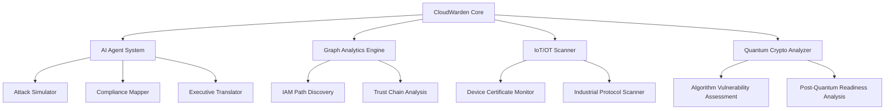

# CloudWarden v3 🛡️

<div align="center">


**Revolutionary AI-Powered Cloud Security Platform**

### 🚀 Find misconfigurations fast. Ship safer.

*by [Nova Titan Systems](https://novatitan.net)*

[](https://www.python.org/downloads/)
[](https://opensource.org/licenses/MIT)
[](https://github.com/psf/black)
[](https://ollama.ai/)
[](https://github.com/PyCQA/bandit)
[](https://novatitan.net/cloudwarden)

[🌟 Features](#-revolutionary-features) • [⚡ Quick Start](#-quick-start) • [📖 Documentation](#-usage-examples) • [🏢 Enterprise](#-enterprise-features)

</div>

---

## 🌟 **Revolutionary Features**

CloudWarden v3 represents a **revolutionary breakthrough in cloud security technology**. Nova Titan Systems proudly introduces the first platform to combine local AI intelligence, quantum-safe analysis, and IoT/OT security in one comprehensive solution. Built from the ground up to solve the security challenges that traditional tools can't address.

### 🧠 **AI-Powered Security Intelligence**

- **Local AI Models**: Uses Ollama (no cloud costs) for complete privacy
- **Business Impact Translation**: AI explains technical risks in executive language
- **Confidence Scoring**: Every analysis includes AI confidence metrics
- **Multi-Model Support**: Primary, fallback, and specialized security models

### 🔗 **Attack Path Discovery**

- **Dynamic Graph Analysis**: Maps complex IAM privilege escalation routes
- **Path Validation**: Uses AWS `SimulatePrincipalPolicy` for evidence-based findings
- **Risk Scoring**: 0-100 scoring based on path complexity and exploitability
- **Attack Simulation**: AI simulates real attacker behavior patterns

### 🏭 **IoT & OT Security Integration**

- **AWS IoT Core Auditing**: Comprehensive device policy analysis
- **Industrial Protocol Support**: Modbus, OPC UA, DNP3, BACnet security assessment
- **Certificate Lifecycle Management**: Automated expiry tracking and rotation alerts
- **Edge Security**: Greengrass deployment security validation

### 🔮 **Quantum-Safe Cryptography Analysis**

- **Algorithm Vulnerability Assessment**: Identifies quantum-vulnerable encryption
- **Migration Roadmaps**: Automated post-quantum crypto transition planning
- **Timeline Predictions**: Threat materialization estimates with business impact
- **Future-Proof Recommendations**: Standards-compliant quantum-safe alternatives

### 📊 **Executive Intelligence Dashboard**

- **Real-Time Metrics**: Live security posture scoring and trend analysis
- **AI-Generated Summaries**: Executive briefings in business language
- **Compliance Automation**: Auto-mapping to CIS AWS, NIST CSF, IEC 62443
- **Mobile-Responsive**: Professional interface optimized for all devices

### ⚡ **Remediation-as-Code**

- **Terraform Generation**: Auto-creates infrastructure-as-code fixes
- **Fix Pack Export**: Bundles remediation scripts in downloadable packages
- **Change Validation**: Simulates fixes before implementation
- **Policy Rewriting**: AI suggests least-privilege policy improvements

---

## 🏗️ **Architecture Overview**

CloudWarden v3 features a revolutionary modular architecture designed for scalability, extensibility, and enterprise deployment:



### **🎯 Core Components**

| Component                         | Description                           | Revolutionary Features             |
| --------------------------------- | ------------------------------------- | ---------------------------------- |
| **AI Agent System**         | Local LLM integration with Ollama     | Zero cloud costs, complete privacy |
| **Graph Analytics Engine**  | NetworkX-based relationship mapping   | Real-time attack path discovery    |
| **IoT/OT Security Scanner** | Industrial device security assessment | First cloud-to-OT security bridge  |
| **Quantum Crypto Analyzer** | Future-threat cryptography analysis   | Quantum timeline predictions       |
| **Executive Dashboard**     | Business intelligence interface       | AI-generated executive summaries   |

---

## ⚡ **Quick Start**

### **1. System Requirements**

```bash
# Required
Python 3.11+
Git
AWS CLI
Ollama (for AI features)

# Optional
Docker (for containerized deployment)
Node.js 18+ (for mobile app component)
```

### **2. Installation**

```bash
# Clone the repository
git clone https://github.com/tzsmit/cloudwarden-v3.git
cd cloudwarden-v3

# Create virtual environment
python -m venv venv
source venv/bin/activate  # Windows: venv\Scripts\activate

# Install dependencies
pip install -r requirements.txt
pip install -e .
```

### **3. AI Setup (Revolutionary Feature)**

```bash
# Install Ollama for local AI
curl -fsSL https://ollama.ai/install.sh | sh

# Download AI models (4-7GB total)
ollama pull llama3.1:8b      # Primary security analysis - 4.7GB
ollama pull deepseek-r1:7b   # Code generation - 4.1GB
ollama pull mistral:7b       # Security reasoning - 4.1GB

# Start Ollama service
ollama serve
```

### **4. AWS Configuration**

```bash
# Configure AWS credentials
aws configure
# Enter your Access Key, Secret Key, Region (us-east-1), Format (json)

# Test connection
aws sts get-caller-identity
```

### **5. First Scan**

```bash
# Run comprehensive security scan
cloudwarden scan --comprehensive

# With AI-powered analysis
cloudwarden scan --with-ai --explain-business-impact

# Generate executive report
cloudwarden scan --format executive-pdf --output security-report.pdf
```

---

## 📖 **Usage Examples**

### **🔍 Basic Security Scanning**

```bash
# Quick security assessment
cloudwarden scan --quick

# Full comprehensive scan with all modules
cloudwarden scan --comprehensive --iot --quantum-crypto

# Specific services and regions  
cloudwarden scan --services iam,iot,lambda --regions us-east-1,us-west-2
```

### **🧠 AI-Enhanced Analysis**

```bash
# Enable AI explanations and recommendations
cloudwarden scan --with-ai --explain-business-impact

# Use specific AI model
cloudwarden scan --ai-model deepseek-r1:7b --generate-terraform

# Compliance mapping with AI
cloudwarden scan --map-compliance --frameworks cis-aws,nist-csf,iec-62443
```

### **🔗 Attack Path Analysis**

```bash
# Discover IAM attack paths
cloudwarden attack-paths --validate-simulation --max-depth 5

# Focus on high-risk escalation routes
cloudwarden attack-paths --min-risk-score 80 --admin-access-only

# Export attack path visualizations
cloudwarden attack-paths --export-graph attack-chains.png
```

### **🏭 IoT & OT Security**

```bash
# Comprehensive IoT security audit
cloudwarden iot-scan --include-greengrass --check-certificates

# Focus on expiring certificates
cloudwarden iot-scan --cert-expiry-days 30 --auto-remediate

# Industrial protocol security assessment
cloudwarden ot-scan --protocols modbus,opcua,dnp3 --network-range 192.168.1.0/24
```

### **📊 Executive Dashboard**

```bash
# Launch the revolutionary web interface
cloudwarden-app

# Custom configuration
streamlit run app.py --server.port 8501
```


---

## 🔧 **Configuration Guide**

### **Environment Variables**

```bash
# AWS Configuration
export AWS_PROFILE=nova-titan-prod
export AWS_REGION=us-east-1

# CloudWarden Settings
export CLOUDWARDEN_CONFIG_FILE=./config/production.yaml
export CLOUDWARDEN_AI_MODEL=llama3.1:8b
export ENABLE_AI_EXPLANATIONS=true

# Reporting
export REPORT_OUTPUT_DIR=./reports
export BRAND_COLORS_PRIMARY=#00F5A0
```

### **Configuration File (cloudwarden.yaml)**

```yaml
# CloudWarden v3 Configuration - Nova Titan Systems
metadata:
  version: "3.0.0"
  organization: "Nova Titan Systems"
  
aws:
  regions:
    - us-east-1
    - us-west-2
    - eu-west-1
  profile: default
  
ai_agent:
  enabled: true
  model: "llama3.1:8b"
  fallback_model: "deepseek-r1:7b"
  ollama_base_url: "http://localhost:11434"
  explain_business_impact: true
  generate_remediation: true
  
scanning:
  modules:
    iam_analysis: true
    iot_security: true
    quantum_crypto: true
    attack_paths: true
  parallel_workers: 8
  timeout_seconds: 600
  
risk_scoring:
  weights:
    attack_path_length: 0.3
    wildcard_policies: 0.25
    mfa_status: 0.2
    public_exposure: 0.15
    quantum_vulnerability: 0.1
  
compliance:
  frameworks:
    - cis-aws-v1.4
    - nist-csf-v1.1
    - iec-62443
  auto_mapping: true
  
remediation:
  generate_terraform: true
  create_fix_packs: true
  validate_changes: true
  
reporting:
  formats:
    - json
    - markdown
    - html
    - executive-pdf
  branding:
    company: "Nova Titan Systems"
    logo_path: "./assets/nova-titan-logo.png"
    primary_color: "#00F5A0"
    background_color: "#1a1a1a"
```

---

## 🚀 **Advanced Features**

### **🧠 AI Attack Simulation**

CloudWarden v3 includes a revolutionary AI-powered attack simulation engine that models real attacker behavior:

```python
from cloudwarden.agent.attack_simulator import AttackSimulator

# Initialize AI-powered attack simulator
simulator = AttackSimulator(model="llama3.1:8b")

# Generate attack scenarios
scenarios = simulator.generate_attack_scenarios(
    target="admin_access",
    max_steps=5,
    include_ai_creativity=True
)

# Validate scenarios with AWS API
validated_scenarios = simulator.validate_scenarios(scenarios)
```

### **🔮 Quantum-Safe Analysis**

Future-proof your infrastructure against quantum computing threats:

```bash
# Analyze quantum vulnerability
cloudwarden quantum-scan --analyze-algorithms --migration-planning

# Generate post-quantum migration roadmap
cloudwarden quantum-scan --export-migration-plan ./quantum-roadmap.pdf

# Algorithm-specific analysis
cloudwarden quantum-scan --focus-algorithms rsa,ecdsa --timeline-estimates
```

### **🏭 Industrial IoT Security**

Comprehensive OT/IoT security for industrial environments:

```bash
# Scan industrial networks
cloudwarden iot-scan --industrial-protocols --network-discovery

# Greengrass edge security
cloudwarden greengrass-audit --edge-devices --data-classification

# Certificate lifecycle management
cloudwarden cert-monitor --auto-renewal --expiry-alerts
```

---

## 🧪 **Development Setup**

### **For Contributors**

```bash
# Clone and setup development environment
git clone https://github.com/tzsmit/cloudwarden-v3.git
cd cloudwarden-v3

# Create development virtual environment
python -m venv venv-dev
source venv-dev/bin/activate

# Install with development dependencies
pip install -e ".[dev]"

# Setup pre-commit hooks for code quality
pre-commit install
```

### **Code Quality Tools**

```bash
# Format code
black cloudwarden tests
ruff format .

# Lint and type checking
ruff check cloudwarden
mypy cloudwarden --ignore-missing-imports

# Security scanning
bandit -r cloudwarden/
safety check
pip-audit
```

### **Testing**

```bash
# Run all tests with coverage
pytest --cov=cloudwarden --cov-report=html

# Integration tests (requires AWS credentials)
pytest tests/integration/ --aws-integration

# AI agent tests (requires Ollama)
pytest tests/test_ai_agent.py --ai-enabled
```

---

## 🔌 **API Documentation**

### **REST API Endpoints**

CloudWarden v3 provides a comprehensive REST API for enterprise integration:

```bash
# Start API server
cloudwarden-api --host 0.0.0.0 --port 8080

# Health check
curl http://localhost:8080/health

# Trigger security scan
curl -X POST http://localhost:8080/api/v1/scan \
  -H "Content-Type: application/json" \
  -d '{"services": ["iam", "s3"], "regions": ["us-east-1"]}'

# Get scan results
curl http://localhost:8080/api/v1/scan/results/{scan_id}

# AI analysis endpoint
curl -X POST http://localhost:8080/api/v1/ai/analyze \
  -H "Content-Type: application/json" \
  -d '{"finding": {...}, "explain_business_impact": true}'
```

### **Python SDK**

```python
from cloudwarden_sdk import CloudWardenClient

# Initialize client
client = CloudWardenClient(
    api_url="https://your-cloudwarden-instance.com",
    api_key="your-api-key"
)

# Trigger scan
scan_job = client.scan.start(
    services=["iam", "s3", "iot"],
    regions=["us-east-1", "us-west-2"],
    enable_ai=True
)

# Wait for completion and get results
results = client.scan.wait_for_completion(scan_job.id)
print(f"Found {len(results.findings)} security findings")

# Generate executive report
report = client.reports.generate_executive_summary(results)
```

---

## 🚀 **Deployment Options**

### **🐳 Docker Deployment**

```dockerfile
# Use official CloudWarden image
FROM novatitan/cloudwarden:v3.0.0

# Configure environment
ENV CLOUDWARDEN_CONFIG_FILE=/app/config/production.yaml
ENV AWS_REGION=us-east-1

# Expose ports
EXPOSE 8501 8080

# Health check
HEALTHCHECK --interval=30s --timeout=10s --start-period=5s --retries=3 \
  CMD curl -f http://localhost:8501/health || exit 1

# Start services
CMD ["cloudwarden-app"]
```

```bash
# Build and run
docker build -t cloudwarden-v3 .
docker run -p 8501:8501 -p 8080:8080 \
  -v $(pwd)/config:/app/config \
  -v $(pwd)/reports:/app/reports \
  cloudwarden-v3
```

### **☁️ Kubernetes Deployment**

```yaml
apiVersion: apps/v1
kind: Deployment
metadata:
  name: cloudwarden-v3
  namespace: security
spec:
  replicas: 3
  selector:
    matchLabels:
      app: cloudwarden-v3
  template:
    metadata:
      labels:
        app: cloudwarden-v3
    spec:
      containers:
      - name: cloudwarden
        image: novatitan/cloudwarden:v3.0.0
        ports:
        - containerPort: 8501
        - containerPort: 8080
        env:
        - name: CLOUDWARDEN_CONFIG_FILE
          value: "/app/config/kubernetes.yaml"
        volumeMounts:
        - name: config
          mountPath: /app/config
        - name: reports
          mountPath: /app/reports
      volumes:
      - name: config
        configMap:
          name: cloudwarden-config
      - name: reports
        persistentVolumeClaim:
          claimName: cloudwarden-reports
```

### **🌐 Cloud Provider Deployment**

#### **AWS ECS Fargate**

```json
{
  "family": "cloudwarden-v3",
  "networkMode": "awsvpc",
  "requiresCompatibilities": ["FARGATE"],
  "cpu": "1024",
  "memory": "2048",
  "containerDefinitions": [
    {
      "name": "cloudwarden",
      "image": "novatitan/cloudwarden:v3.0.0",
      "portMappings": [
        {"containerPort": 8501, "protocol": "tcp"},
        {"containerPort": 8080, "protocol": "tcp"}
      ],
      "environment": [
        {"name": "AWS_REGION", "value": "us-east-1"},
        {"name": "ENABLE_AI_EXPLANATIONS", "value": "true"}
      ]
    }
  ]
}
```

---

## 🗺️ **Roadmap**

### **🎯 Launch Release (v3.0) - 🚀 NOW AVAILABLE**

- [x] **AI-Powered Security Analysis** - Revolutionary local Ollama integration
- [x] **Attack Path Discovery** - Dynamic IAM privilege escalation mapping
- [x] **IoT/OT Security Integration** - First cloud-to-industrial security bridge
- [x] **Quantum-Safe Cryptography** - Future-proof security analysis
- [x] **Executive Intelligence Dashboard** - AI-generated business insights
- [x] **Remediation-as-Code** - Automated Terraform fix generation

### **🚀 Next Release (v3.1) - 🚧 IN PROGRESS**

| Feature                             | Status         | ETA     |
| ----------------------------------- | -------------- | ------- |
| Multi-cloud support (Azure, GCP)    | 🚧 Development | Q3 2025 |
| Advanced ML anomaly detection       | 📋 Planning    | Q3 2025 |
| Real-time threat intelligence feeds | 📋 Planning    | Q4 2025 |
| Mobile security alerts app          | 🚧 Development | Q3 2025 |
| Kubernetes security scanning        | 📋 Planning    | Q4 2025 |

### **🌟 Future Releases (v4.0+) - 📋 PLANNED**

- [ ] **Autonomous Security Remediation**: Self-healing infrastructure
- [ ] **Predictive Threat Modeling**: AI predicts future attack vectors
- [ ] **Supply Chain Security Analysis**: Third-party dependency scanning
- [ ] **Zero-Trust Architecture Generator**: Automated ZTA implementation
- [ ] **Quantum Encryption Implementation**: Post-quantum crypto deployment

---

## 🏢 **Enterprise Features**

### **🚀 Nova Titan Professional Services**

Transform your cloud security posture with Nova Titan's expert services:

- **🔍 CloudWarden Implementation**: Professional deployment and configuration
- **📊 Custom Dashboard Development**: Tailored security intelligence interfaces
- **🧠 AI Model Training**: Custom models for your specific threat landscape
- **📈 Compliance Automation**: Streamlined audit and reporting workflows
- **⚡ 24/7 Security Monitoring**: Continuous threat detection and response

**Contact**: [info@novatitan.net](mailto:info@novatitan.net) • [support@novatitan.net](mailto:support@novatitan.net) • [novatitan.net](https://novatitan.net)

### **🏭 Industry-Specific Solutions**

| Industry                     | Specialized Features                         | Key Benefits                |
| ---------------------------- | -------------------------------------------- | --------------------------- |
| **Manufacturing**      | OT/IoT security, industrial protocol support | Smart factory protection    |
| **Energy & Utilities** | NERC CIP compliance, critical infrastructure | Grid security assurance     |
| **Healthcare**         | HIPAA compliance, PHI protection             | Patient data security       |
| **Financial Services** | PCI DSS, SOX compliance, threat modeling     | Regulatory compliance       |
| **Government**         | FedRAMP, FISMA compliance, zero-trust        | National security standards |

---

## 🤝 **Contributing**

We welcome contributions from the security community! CloudWarden v3 is built to be extensible and community-driven.

### **🎯 Priority Areas**

- AI agent improvements and new model integrations
- Additional compliance framework mappings
- IoT/OT security modules for new protocols
- Quantum cryptography analysis enhancements
- Executive reporting templates

### **📝 Contribution Process**

1. **Fork** the repository
2. **Create** your feature branch (`git checkout -b feature/AmazingFeature`)
3. **Commit** your changes (`git commit -m 'Add AmazingFeature'`)
4. **Push** to the branch (`git push origin feature/AmazingFeature`)
5. **Open** a Pull Request

### **🛠️ Development Guidelines**

- Follow PEP 8 style guidelines (enforced by `black` and `ruff`)
- Write comprehensive tests for new features
- Update documentation for user-facing changes
- Ensure AI prompts are well-tested and effective
- Include security considerations in all contributions

### **💡 Feature Requests**

Have an idea for CloudWarden? We'd love to hear it!

- [Open an issue](https://github.com/tzsmit/cloudwarden-v3/issues/new) with the `enhancement` label
- Join our [discussions](https://github.com/tzsmit/cloudwarden-v3/discussions) for design conversations
- Email [traivonesmith@novatitan.net](mailto:traivonesmith@novatitan.net) for development discussions

---

## 📄 **License & Support**

### **📜 License**

CloudWarden v3 is licensed under the **MIT License**. See [LICENSE](LICENSE) for full details.

### **🆘 Support Channels**

| Support Type                   | Contact Method                                                 | Response Time |
| ------------------------------ | -------------------------------------------------------------- | ------------- |
| **Community Support**    | [GitHub Issues](https://github.com/tzsmit/cloudwarden-v3/issues)  | Best effort   |
| **Documentation**        | [GitHub Wiki](https://github.com/tzsmit/cloudwarden-v3/wiki)      | Self-service  |
| **Professional Support** | [support@novatitan.net](mailto:support@novatitan.net)             | 24-48 hours   |
| **Business Inquiries**   | [info@novatitan.net](mailto:info@novatitan.net)                   | 24-48 hours   |
| **Direct Contact**       | [traivonesmith@novatitan.net](mailto:traivonesmith@novatitan.net) | 24-48 hours   |

### **🏢 About Nova Titan Systems**

**Nova Titan Systems** is a leading provider of AI-powered cybersecurity solutions, specializing in cloud security, network protection, and industrial IoT security. Founded by cybersecurity expert Traivone Smith and based in Lubbock, Texas, Nova Titan Systems serves clients nationwide with cutting-edge technology and expert consulting services.

**Services**: Cloud Security • Network Protection • IoT/OT Security • AI Integration
**Industries**: Manufacturing • Energy • Healthcare • Finance • Government
**Contact**: [novatitan.net](https://novatitan.net) • [info@novatitan.net](mailto:info@novatitan.net) • [traivonesmith@novatitan.net](mailto:traivonesmith@novatitan.net)

---

## 🚀 **Get Started Today**

CloudWarden v3 represents a new era in cloud security. As Nova Titan Systems launches this revolutionary platform, we're looking for forward-thinking security teams to join us in transforming how organizations approach cloud security.

### **🎯 Early Adopter Benefits**

- **Priority Support**: Direct access to Nova Titan's security experts during implementation
- **Feature Influence**: Help shape the roadmap by providing feedback on what matters most
- **Case Study Opportunities**: Showcase your success with CloudWarden (with your permission)
- **Training & Workshops**: Complimentary training sessions for your security team

### **📞 Ready to Transform Your Security Posture?**

**Contact Nova Titan Systems:**

- **Email**: [info@novatitan.net](mailto:info@novatitan.net)
- **Website**: [novatitan.net](https://novatitan.net)
- **Phone**: Available upon request for enterprise inquiries

**Perfect for:**

- Security teams looking to leverage AI for faster threat detection
- Organizations with IoT/OT infrastructure requiring specialized security
- Companies preparing for quantum computing threats
- Enterprises needing executive-level security reporting

---
## ⚠️ **Responsible Use**
CloudWarden v3 is designed for authorized security assessment of your own infrastructure only. Users are responsible for ensuring compliance with all applicable laws and regulations.
### 🛡️ **Defensive Security Tool**
CloudWarden is built exclusively for defensive cybersecurity purposes to help organizations identify and remediate security vulnerabilities in their own systems.

<div align="center">

### **🛡️ Find misconfigurations fast. Ship safer with CloudWarden v3.**

*Powered by Nova Titan Systems • Built for the Future of Cybersecurity*

[](https://novatitan.net)
[](https://github.com/tzsmit/cloudwarden-v3)
[](https://novatitan.net/cloudwarden)

**[⭐ Star this repository](https://github.com/tzsmit/cloudwarden-v3) • [🐦 Follow @NovaTitanSys](https://twitter.com/novatitansys) • [💼 LinkedIn](https://linkedin.com/company/nova-titan-systems)**

</div>
